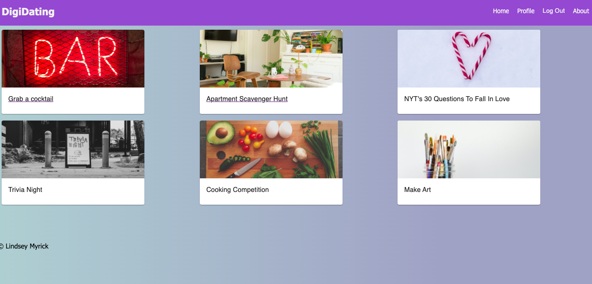

# DigiDating
Duration: 2 week sprint 

Dating Digitally is a full-stack web application that allows users to connect and grow relationships virtually. It replicates traditional, in-person dating experiences that may be impossible due to distance or factors like social distancing. Users can choose from different activities, such as "visiting the bar" or "exploring someone's apartment", that are facilitated through embedded video-conferencing technology. 

The "visiting the bar" section of the application allows users to find cocktail recipes through TheCockTailDB, an open, crowd-sourced database of drinks. Users can filter recipes by alcohol type, see a gallery of options, and access the recipe and ingredients. If a user enjoys a recipe, they can favorite it and add comments, thereby adding it to their own database of favorites. Throughout this process, users can connect with a date through a video-chat on screen. 

In the future, more activities will be added to DigiDating. 

## Screenshots

## Prerequisites

Before you get started, make sure you have the following software installed on your computer:

- [Node.js](https://nodejs.org/en/)
- [PostrgeSQL](https://www.postgresql.org/)
- [Nodemon](https://nodemon.io/)

## Usage

After a user logs in, they can visit the profile page, link in Nav Bar, to connect with their date. If they are the first one to log in, they can type their date's username into the textfield to send an invite to their account. If their date has already invited them, that invitation will show on the page. A video meeting will automatically pop up. 

For the cocktail activity, users can click the "get a cocktail" card on the landing page. They can either filter by alcohol type, by clicking one of the icons, or search by name in the search bar. By clicking a card, they will see the full recipe. If the user would like easy access in the future, they can add to their favorites. 

## Built with 

React, Redux, Express, Node, Material UI, the CocktailDB API, the Daily-Co API, Sweet Alert, Draggable

## Acknowledgement 

Thanks to Prime Digital Academy who equipped and helped me to make this application a reality. 

## Support 

If you have any suggestions or issues, please email me at lindsey.k.myrick@gmail.com
